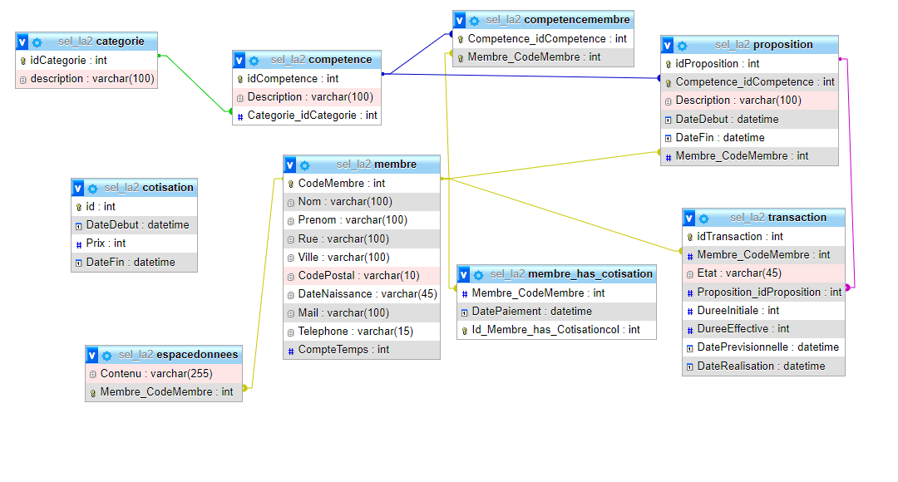
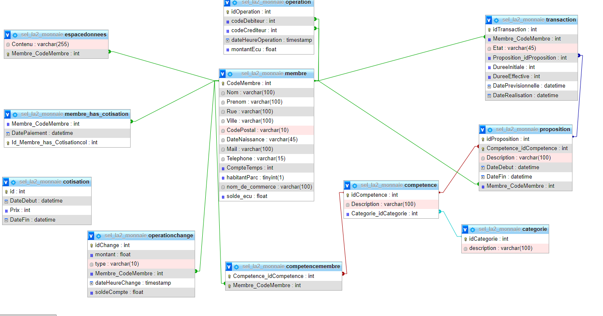

#  SEL et Monnaie Locale : PLSQL


## Introduction

Ce document sert de compte rendu au TP n°2 de Base de Données réaliser lors de l'année 2021-2022.  
Ce document permet de répondre aux questions et d'exposer nos choix et nos réalisation.

Les membre du groupe ayant réalisé ce TP se trouvent dans la partie "Contributeurs", la dernière partie de ce document.

Le script de création de la base de données initialement réalisée lors du TP1, sans les vues, procédures et fonctions réalisées lors du TP2, se trouve dans le fichier **SEL_LA2_Model.sql**.

Le schéma se trouve ici :


## Documentation supplémentatire

Le projet possède également un ensemble de documentation qui se trouve [ici](https://drive.google.com/drive/folders/1HUtnfMiaElMgTJvxY6ZfwDOUtS7gWKOl?usp=sharing).

## Questions

### Question 1

#### 1.1, 1.2 et 1.3

Nous avons fait le choix de créer une vue **ACTIVE_MEMBER**, elle gérera donc la mise à jour de l'état des membres en fonction de la date de leur dernière cotisation autant dans le cas d'un nouveau payement que d'une vérification quotidienne.

Voici le script de création de la vue **ACTIVE_MEMBER**:
```sql
CREATE VIEW ACTIVE_MEMBER AS
SELECT Membre_CodeMembre FROM membre_has_cotisation
WHERE DATE_ADD(DatePaiement,INTERVAL 1 YEAR) > CURRENT_DATE();
```

#### 1.4

Voici le trigger réalisé :
```sql
 CREATE TRIGGER init_time_counter BEFORE INSERT ON membre FOR EACH ROW SET NEW.CompteTemps = 10;
```

#### 1.5

Voici le script de création de la procédure :

```sql
DELIMITER $$
CREATE PROCEDURE updateTransactionStatus(IN newStatus VARCHAR(45), IN transactionId INT)
BEGIN
	DECLARE newCompteTemps INT;
	DECLARE beneficiary INT;
    DECLARE propositionId INT;
    DECLARE author INT;
    IF newStatus = "Terminé" THEN
   		SELECT DureeEffective, Membre_CodeMembre, Proposition_idProposition INTO newCompteTemps, beneficiary, propositionId FROM transaction WHERE idTransaction = transactionId LIMIT 1;
    	SELECT Membre_CodeMembre INTO author FROM proposition WHERE idProposition = propositionId LIMIT 1;
    	UPDATE membre SET CompteTemps=CompteTemps+newCompteTemps WHERE CodeMembre = author LIMIT 1;
        UPDATE membre SET CompteTemps=CompteTemps-newCompteTemps WHERE CodeMembre = beneficiary LIMIT 1;
    END IF;
END;
$$
```

Et le script d'ajout du trigger  :

```sql
DELIMITER $$
CREATE TRIGGER UPDATE_ON_TRANSACTION_STATUS
 AFTER
UPDATE ON transaction
FOR EACH ROW
BEGIN
	CALL updateTransactionStatus(NEW.Etat, NEW.idTransaction);
END;
$$
```

### Question 2

#### 2.1

Voici la fonction réalisée :

```sql
DELIMITER $$
CREATE FUNCTION `SERVICES_DURING_PERIOD`(`beginDate` DATE, `endDate` DATE)
RETURNS INT DETERMINISTIC
BEGIN
DECLARE hoursCounter INT;
IF beginDate < endDate THEN
SELECT SUM(DureeEffective) INTO hoursCounter FROM transaction WHERE DateRealisation IS NOT NULL AND DureeEffective IS NOT NULL AND(DateRealisation BETWEEN beginDate AND endDate);
ELSE
SELECT SUM(DureeEffective) INTO hoursCounter FROM transaction WHERE DateRealisation IS NOT NULL AND DureeEffective IS NOT NULL AND(DateRealisation BETWEEN endDate AND beginDate);
END IF;
return hoursCounter;
END;
$$
```

#### 2.2

Voici la procedure réalisée :

```sql
DELIMITER $$
CREATE PROCEDURE searchPropositions(IN `beginDate` DATE, IN `endDate` DATE, IN `competenceLabel` VARCHAR(100))
BEGIN
    	DECLARE competenceId INT;
        SELECT idCompetence INTO competenceId FROM competence WHERE Description = competenceLabel;
    	CREATE TEMPORARY TABLE temp_proposition_filtered SELECT * FROM proposition WHERE DateDebut < beginDate AND DateFin > endDate AND Competence_idCompetence = competenceId;
END
$$
```
Voici un exemple de son utilisation:
```sql
CALL searchPropositions(DATE("2021-11-11 01:02:03"), DATE("2021-11-25"), "piano");
SELECT * FROM temp_proposition_filtered;
```

### Question 3

#### Ordre de publication 
L’ordre de création et d'insertion dans les tables a une importance pour ne pas générer d'erreurs car il y a des clés étrangères et des clés primaires
Il faudra donc les générer dans l'ordre suivant : 
Membres
Categorie
Competences
cotisation  
Propositions 
Transactions

#### Membres

La génération des membres se fait sur la base d'un fichier CSV.  
Celui-ci contient à la base :
- nom
- prénom
- numéro de téléphone
- adresse
- code postale
- ville de résidence
- date de naissance
- un identifiant unique qui sera notre codeMembre

Nous avons utilisé le fichier **customer.csv** fournit lors de la première séance de TP dont nous avons modifié les noms de tables afin qu'il corresponde au schéma de notre table membre.  
De plus, nous avons rempli les champs avec leurs valeurs par défaut.  
Ceci nous a permis d'avoir un ensemble de données de base sur les utilisateurs.
Nous avons appelé le fichier modifié **membre.csv**

Afin de générer la valeur de **habitantParc**, nous avons utilisé la fonction RAND() de mysql afin de générer un entier dans la plage *[0; 1]*.  

Voici la requête utilisée :

```sql
UPDATE `membre` SET `habitantParc`= RAND();
```

Pour ce qui est du champs **Mail**, nous avons simplement concaténé et mis en minuscule le nom et prénom afin de former une adresse mail sous ce format : **prenom.nom@gmail.com**.
Voici la requête utilisée :
```sql
UPDATE `membre` SET `Mail`= LOWER(CONCAT(prenom, ".", nom, "@gmail.com"));
```

Finalement, pour la génération des noms de commerce, puisque tous les utilisateurs ne devaient pas en avoir et que nous souhaitions garder l'aléatoire lors de la génération du nom, nous avons d'abord créé une fonction capable de générer une chaine de caractères aléatoire en fonction de sa taille maximale.  

La génération aléatoire de chaque caractère est inspirée d'un script proposé [ici](https://stackoverflow.com/a/16738409).

Voici le script de création de cette fonction :
```sql
DELIMITER $$
CREATE FUNCTION generateRandomString(maxLength INT)
	RETURNS VARCHAR(256) DETERMINISTIC
BEGIN
	DECLARE length INT;
    DECLARE randomStringGenerated VARCHAR(256);
    DECLARE counter INT ;

    -- Initialize variables
    SET counter = 0;
    SET randomStringGenerated = "";

    -- Pick a random length between maxLength and 90% of max length.
    SET length = FLOOR(RAND()*(maxLength-(maxLength * 0.9)+1) + (maxLength * 0.9));

    -- Loop to generate the random string depending on the chosen length
    label1: LOOP
      SET counter = counter + 1;
      IF counter < length THEN
      	SET randomStringGenerated = CONCAT(randomStringGenerated, substring('ABCDEFGHIJKLMNOPQRSTUVWXYZ', rand(@seed:=round(rand(@seed)*4294967296))*26+1, 1));
        ITERATE label1;
      END IF;
      LEAVE label1;
    END LOOP label1;

    RETURN randomStringGenerated;
 END
 $$
```

Il ne restait plus qu'à créer une fonction qui déciderait, de manière aléatoire si le membre était propriétaire ou non, autrement dit, si le champ **nom_du_commerce** serait rempli ou à **NULL**.

Voici la fonction réalisée :

```sql
DELIMITER $$
CREATE FUNCTION defineIfMemberIsProfessional()
	RETURNS VARCHAR(50) DETERMINISTIC
BEGIN
	DECLARE businessName VARCHAR(50);

    -- There's 1/3 chance to be a professional
    IF FLOOR(RAND()*(3)) > 1 THEN
      SET businessName = generateRandomString(50);
    END IF;

	RETURN businessName;
END
$$
```

Cette fonction renvoie **NULL** si l'utilisateur est un particulier, sinon elle renvoie un nom de commerce.  

Il suffit alors de l'appeler comme suit :
```sql
UPDATE `membre` SET `nom_de_commerce`= defineIfMemberIsProfessional()
```

Afin d'ajouter les données de table des membres, il faudra donc, en premier lieu importer le fichier **membre.csv**.
Ensuite, le script **randomDataInsertion.sql** permettra la modification des champs non saisis dans le fichier csv.

#### Cotisations

Nous avons souhaitez générer un nombre aléatoire de cotisations durant les années entre 2000 et maintenant.  
Il y a 1/5 chances d'avoir une nouvelle cotisation chaque année. Le prix variant entre 5 et 25€.

Voici la fonction réalisée :
```sql
DELIMITER $$
CREATE PROCEDURE addRandomMembershipTariff()
BEGIN
  DECLARE counter INT;
  DECLARE newTariff INT;
  DECLARE oldTariff INT;
  DECLARE newTariffBeginDate DATE;

  SET counter = 0;

  -- iterate through years since 2001
  yearLoop: LOOP
    SET counter = counter + 1;
    SET newTariff = NULL;
    IF counter < (YEAR(CURRENT_DATE()) - 2000) THEN
      -- Randomly determine weather or not a new membership tariff has been defined
      -- There is 1/5 chance
      IF RAND() * 5 > 3 THEN
        -- Retrieve current tariff
        SELECT Prix INTO oldTariff FROM cotisation WHERE dateFin IS NULL;

        -- Iterate while new tariff is equal to the old one
        tariffLoop: LOOP
          -- Randomly generate a new tariff between5 and 25
          SET newTariff = RAND()* (21) + 5;
          IF newTariff = oldTariff AND oldTariff IS NOT NULL THEN
            ITERATE tariffLoop;
          END IF;
        LEAVE tariffLoop;
        END LOOP tariffLoop;

          IF newTariff IS NOT NULL THEN

              -- 2000 + counter gives the year of the new tariff
              SET newTariffBeginDate = STR_TO_DATE(CONCAT('01,1,', (2000 + counter)),'%d,%m,%Y');

              -- Define old tariff end date
              UPDATE cotisation SET DateFin = DATE_SUB(newTariffBeginDate,INTERVAL 1 DAY) WHERE DateFin IS NULL;

              -- Insert the new tariff
              INSERT INTO cotisation(DateDebut, Prix) VALUES (
              newTariffBeginDate,
              newTariff
              );
          END IF;
      END IF;
      ITERATE yearLoop;
    END IF;
  LEAVE yearLoop;
  END LOOP yearLoop;
END
$$
```
Dans le but d'avoir des compétences et catégories existants à vérifier plus simplement, nous avons choisi de les insérer à partir d'un csv. 
Elle ne seront donc pas aléatoire. 
On va insérer les 2 fichiers csv et exporter le script qui figure avec tous les scripts de créations et insertions de tables dans le répertoire dumps/Dumps20211118.

#### Competence Membre 
Voici la procédure réalisée pour l'insertion de données dans la table CompetenceMembre

```sql
DELIMITER $$
USE sel_la2_monnaie$$
CREATE DEFINER=root@localhost PROCEDURE competencemembres()
BEGIN
declare i integer;
declare cle_exist integer;
declare nb_iteration integer;
declare nombre_competences integer;
declare competence_aleatoire integer;
declare nombre_membre integer;
declare j integer;
select count() into nombre_membre from membre;
select count() into nombre_competences from competence;
set i=1;
boucle_competence_membre : loop
    set nb_iteration = RAND()(6-1)+1;
    set nb_iteration = nb_iteration-2;
    set j=1;
    boucle_nb_competence : loop

        if j>nb_iteration then 
            leave boucle_nb_competence;
        end if;
        set competence_aleatoire = RAND()(nombre_competences-1)+1;
        select count(*) into cle_exist from competencemembre where Competence_idCompetence= competence_aleatoire and Membre_CodeMembre=i;
        if cle_exist=0 then
            insert into competencemembre values(competence_aleatoire,i);
        end if;
        set j=j+1;
        iterate boucle_nb_competence;
    end loop;
    if i < nombre_membre then
        set i=i+1;
        iterate boucle_competence_membre;
    end if;
    leave boucle_competence_membre;

end loop;
END$$

DELIMITER ;
;
```

### Proposition 
Voici la procédure créée pour automatisation de la création des insertions dans la table proposition 

```sql
DELIMITER $$
USE sel_la2_monnaie$$
CREATE DEFINER=root@localhost PROCEDURE propositions()
BEGIN
declare i integer;
declare nombre_membre integer;
declare nombre_competences integer;
declare date_debut_proposition date;
declare membre_aleatoire integer;
declare competence_aleatoire integer;
declare nb_jours_proposition integer;
declare datefin date;
declare description_competence varchar(120);
declare ligne_aleatoire integer;
declare nb_competences integer;
select count() into nombre_membre from membre;
select count() into nombre_competences from competence;

set i=1;
boucleNbIteration : loop
    set membre_aleatoire=RAND()*(nombre_membre-1)+1;
    set date_debut_proposition=date_format(
        from_unixtime(
             rand() *
                (unix_timestamp('2021-01-01 16:00:00') - unix_timestamp(now())) +
                 unix_timestamp(now())
                      ), '%Y-%m-%d ');
    set nb_jours_proposition=RAND()(365-1)+1;
    select DATE_ADD(date_debut_proposition, INTERVAL nb_jours_proposition DAY) into datefin;
    select count() into nb_competences from competencemembre where Membre_CodeMembre=membre_aleatoire;
    if nb_competences>0 then 
    set ligne_aleatoire=RAND()*(nb_competences-1)+1;
    set ligne_aleatoire=ligne_aleatoire-1;
    SELECT Competence_idCompetence into competence_aleatoire from competencemembre Where Membre_CodeMembre=membre_aleatoire LIMIT 1 OFFSET ligne_aleatoire;
    select description into description_competence from competence where idCompetence=competence_aleatoire;
    insert into proposition values(i,competence_aleatoire,description_competence,date_debut_proposition,datefin,membre_aleatoire);
    end if;
    if i<12000 then
    set i=i+1;
    iterate boucleNbIteration;
    end if;
leave boucleNbIteration;
end loop;

END$$

DELIMITER ;
;
```

### Insertion Transaction 

Voici la procédure créée pour l'insertion de données aléatoires dans la table Transaction : 
```sql
DELIMITER $$
USE `sel_la2_monnaie`$$
CREATE DEFINER=`root`@`localhost` PROCEDURE `transactions`()
BEGIN
declare i integer;
declare nb_utilisateur integer;
declare nb_proposition integer;
declare utilisateur_aleatoire integer;
declare proposition_aleatoire integer;
declare duree_initiale integer;
declare duree_effective integer;
declare date_previsionnelle date;
declare date_debut_prop date;
declare date_fin_prop date;
declare existe integer;
declare etat varchar(50);
set i=1;
select count(*) into nb_utilisateur from membre;
select count(*) into nb_proposition from proposition;

boucle : loop
    set utilisateur_aleatoire=RAND()*(nb_utilisateur-1)+1;
    set proposition_aleatoire=RAND()*(nb_proposition-1)+1;
    select count(*) into existe from proposition where idProposition=proposition_aleatoire;
    if existe <>0 then
        set duree_initiale=RAND()*(10-1)+1;
        set duree_effective=RAND()*(10-1)+1;
        select DateDebut,DateFin into date_debut_prop,date_fin_prop from proposition where idProposition=proposition_aleatoire;
        set date_previsionnelle=date_format(
            from_unixtime(
                 rand() *
                    (unix_timestamp(date_debut_prop) - unix_timestamp(date_fin_prop)) +
                     unix_timestamp(date_fin_prop)
                          ), '%Y-%m-%d ');
                          
         if date_previsionnelle<now() then
            set etat='termine';
         else if date_previsionnelle=now() then
            set etat='en cours';
            else set etat='planifiee';
            set duree_effective=null;
            end if;
         end if;
         insert into transaction values (i,utilisateur_aleatoire,etat,proposition_aleatoire,duree_initiale,duree_effective,date_previsionnelle,date_previsionnelle);
    end if;
    if i<12000 then 
        set i=i+1;
        iterate boucle;
    end if;
    leave boucle;
end loop;
END$$

DELIMITER ;
;
```

### Question 4

#### 4.1



#### 4.2

Le script de création de la base de données (sans vue, fonction ou procédure) modifiée se trouve dans le fichier **SEL_LA2_MONNAIE_Model.sql**.

#### 4.3

Fonctions :


1. Procedures :
  - Mise à jour du solde d'écus des membres :
```sql
DELIMITER $$
CREATE PROCEDURE updateMemberBalance(IN amount FLOAT, IN memberCode INT)
BEGIN
	UPDATE membre SET solde_ecu = (solde_ecu + amount) WHERE CodeMembre = memberCode;
END
$$
```

2. Triggers :
  - Mise à jour du solde de la banque lors d'un update **operationchange** :
    ```sql
    DELIMITER $$
    CREATE TRIGGER UPDATE_BANK_BALANCE_ON_UPDATE
    BEFORE  UPDATE ON operationchange
    FOR EACH ROW
    BEGIN
    	DECLARE lastBalance FLOAT;
        SET lastBalance = (SELECT soldeCompte FROM operationchange GROUP BY dateHeureChange HAVING MAX(dateHeureChange));
    	SET new.soldeCompte = ((new.montant - old.montant) + lastBalance);
    END
    $$
    ```
  - Mise à jour du solde de la banque lors d'un insert **operationchange** :
    ```sql
    DELIMITER $$
    CREATE TRIGGER UPDATE_BANK_BALANCE_ON_INSERT
    BEFORE  INSERT ON operationchange
    FOR EACH ROW
    BEGIN
    	DECLARE lastBalance FLOAT;
      SET lastBalance = (SELECT soldeCompte FROM operationchange GROUP BY dateHeureChange HAVING MAX(dateHeureChange));
      IF lastBalance IS NULL THEN
        SET new.soldeCompte = new.montant;
      ELSE
    	 SET new.soldeCompte = (new.montant + lastBalance);
      END IF;
    END
    $$
    ```
  - Mise à jour du solde de l'utilisateur lors d'un udpdate dans **operationchange** :
    ```sql
    DELIMITER $$
    CREATE TRIGGER UPDATE_MEMBER_BALANCE_ON_UPDATE_IN_CHANGE
    BEFORE  UPDATE ON operationchange
    FOR EACH ROW
    BEGIN
      	CALL updateMemberBalance(NEW.montant - OLD.montant, NEW.Membre_CodeMembre);
    END
    $$
    ```
  - Mise à jour du solde de l'utilisateur lors d'un insert dans **operationchange** :
    ```sql
    DELIMITER $$
    CREATE TRIGGER UPDATE_MEMBER_BALANCE_ON_INSERT_IN_CHANGE
    BEFORE  INSERT ON operationchange
    FOR EACH ROW
    BEGIN
      	CALL updateMemberBalance(NEW.montant, NEW.Membre_CodeMembre);
    END
    $$
    ```

  - Mise à jour du solde des utilisateurs lors d'un INSERT dans **operation**
    ```sql
    DELIMITER $$
    CREATE TRIGGER UPDATE_MEMBER_BALANCE_ON_INSERT_IN_OPERATION
    BEFORE  INSERT ON operation
    FOR EACH ROW
    BEGIN
      	CALL updateMemberBalance(NEW.montantEcu, NEW.codeCrediteur);
        CALL updateMemberBalance(-NEW.montantEcu, NEW.codeDebiteur);
    END
    $$
    ```
  - Mise à jour du solde des utilisateurs lors d'un UPDATE dans **operation**
      ```sql
      DELIMITER $$
      CREATE TRIGGER UPDATE_MEMBER_BALANCE_ON_UPDATE_IN_OPERATION
      BEFORE  UPDATE ON operation
      FOR EACH ROW
      BEGIN
        	CALL updateMemberBalance(NEW.montantEcu, NEW.codeCrediteur);
          CALL updateMemberBalance(-NEW.montantEcu, NEW.codeDebiteur);
      END
      $$
      ```
    _Pour les précédents triggers, il semble improbable qu'on update les tables operation et operationchange. Cependant, afin de garder la cohérence des données, nous avons prévus les triggers nécessaires._

#### 4.4

Voici le script de la fonction demandée :
```sql
DELIMITER $$
CREATE FUNCTION sumEcus()
RETURNS FLOAT DETERMINISTIC
BEGIN
	DECLARE sumEcus FLOAT;
  SELECT SUM(solde_ecu) INTO sumEcus FROM membre;
  RETURN sumEcus;
END;
$$
```

#### 4.5

Voici le script de la fonction demandée :
```sql
DELIMITER $$
CREATE FUNCTION sumEcusExchangedInPeriod(beginDate TIMESTAMP, endDate TIMESTAMP)
RETURNS FLOAT DETERMINISTIC
BEGIN
DECLARE sumEcus FLOAT;
  SELECT SUM(montantEcu) INTO sumEcus FROM operation WHERE dateHeureOperation BETWEEN beginDate AND endDate;
  RETURN sumEcus;
END;
$$
```

#### 5.1
On remet le solde d'écu de chaque membre à 10, valeur initiale. 
```update membre set solde_ecu=10;```

On va parcourir l'ensemble des utilisateurs et récupèrer leur nombre de transaction dans le mois et mettre à jour le solde en conséquence. 
Voici le script de la fonction demandée :

```sql
DELIMITER $$
CREATE PROCEDURE MAJECUPARMOIS()
BEGIN
DECLARE nb_utilisateur INTEGER;
SELECT COUNT(*) into nb_membres from membre;
boucle : loop
	set i=i+1;
	SELECT COUNT(*) into nb_transactions from transaction where Membre_CodeMembre=i and month(DateRealisation)=month(curdate()) and year(DateRealisation) = year(curdate());
	if nb_transactions=0 then 
		update membre set solde_ecu=solde_ecu-3 where id_utilisateurs=i;
	else if nb_transactions >=50 then 
		update membre set solde_ecu=solde_ecu+((nb_transactions%50)*3) where id_utilisateur=i;
	end if;
	end if;
	 if i<nb_utilisateur then 
	 	iterate boucle;
	end if;
leave boucle;
end loop;
END
```
#### 5.3
Mise à jour des soldes de compte suite aux opérations de débit ou de crédit. 
Voici le script de la fonction demandée :
```sql
DELIMITER $$
CREATE PROCEDURE MAJECUPARTRANSACTION(IN Debiteur INT, Crediteur INT, IN Montant INT)
BEGIN
update membre set solde_ecu=solde+Montant where CodeMembre=Crediteur;
update membre set solde_ecu=solde-Montant where CodeMembre=Debiteur;
END
```
Les triggers associés ont été créés dans la question 4.3 :
```
UPDATE_BANK_BALANCE_ON_UPDATE, UPDATE_BANK_BALANCE_ON_INSERT, UPDATE_MEMBER_BALANCE_ON_UPDATE_IN_CHANGE, UPDATE_MEMBER_BALANCE_ON_INSERT_IN_CHANGE, UPDATE_MEMBER_BALANCE_ON_INSERT_IN_OPERATION, UPDATE_MEMBER_BALANCE_ON_UPDATE_IN_OPERATION.
```

## Contributeurs

Réalisé par :
- Amandine Deraedt ([ama62nde](https://github.com/ama62nde))
- Corentin Destrez ([Lafie-rage](https://github.com/Lafie-rage))
